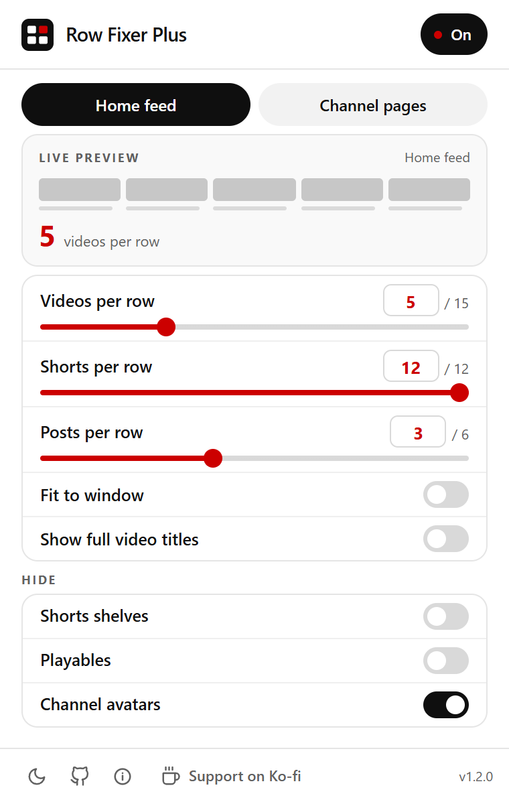
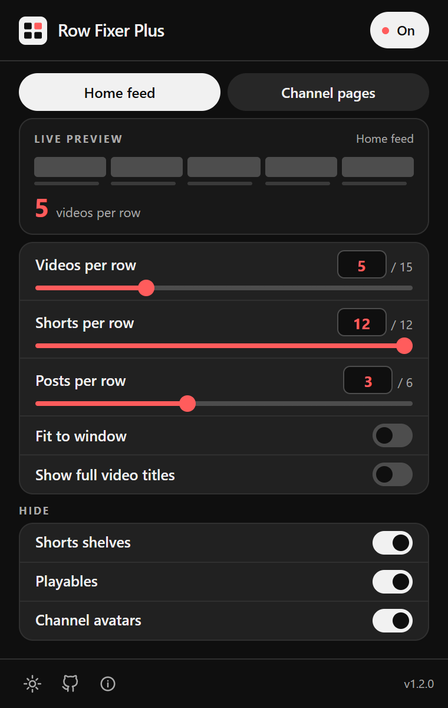

<div align="center">


# Row Fixer Plus

**Your feed. Your rules.**

Choose how many videos fit in a row on YouTube, and hide the things you never watch.

[](LICENSE)
[](https://github.com/LukeOsland1/row-fixer-plus/stargazers)
[](https://github.com/LukeOsland1/row-fixer-plus/issues)
[](https://ko-fi.com/lukeosland)




</div>

## 📑 Table of Contents

- [📷 Screenshots](#-screenshots)
- [🎛️ What you can change](#️-what-you-can-change)
- [✨ Installation](#-installation)
- [🧑‍💻 Contributing](#-contributing)
- [💰 Support](#-support)
- [🔒 Privacy](#-privacy)
- [©️ Credit](#️-credit)
- [©️ License](#️-license)

## 📷 Screenshots

| Layout | Hide |
| --- | --- |
|  |  |

## 🎛️ What you can change

- Videos, Shorts, and community posts per row — drag the slider or type an exact number.
- Separate row settings for channel pages.
- Hide Shorts shelves, Playables, and channel avatars.
- Show full video titles instead of truncated ones.
- Fit the grid to smaller windows, and give channel pages a wider layout.
- Light and dark, matching YouTube's own interface.

Everything sits on one screen, and a live preview at the top shows the change before you go looking for it.

## ✨ Installation

Not on the Chrome Web Store or Firefox Add-ons yet, so build it yourself. Needs Node 20 or newer.

```bash
npm ci
npm run build
```

Then:

1. Open `chrome://extensions` (or `edge://extensions`).
2. Turn on **Developer mode**, click **Load unpacked**.
3. Pick the `build` folder.
4. Refresh YouTube.

Rebuilt it? Reload the extension on the extensions page, then refresh YouTube again. If you have the original YouTube Row Fixer installed, disable it — the two will fight over the same layout.

`npm run zip` produces the store archives in `zip/`.

## 🧑‍💻 Contributing

Issues and pull requests are welcome. See [CONTRIBUTING.md](CONTRIBUTING.md) for the dev setup.

## 💰 Support

If this saved you some scrolling, you can [buy me a coffee](https://ko-fi.com/lukeosland). Entirely optional.

## 🔒 Privacy

Your settings stay in your browser. No account, no analytics, no tracking, nothing sent anywhere. See [PRIVACY.md](PRIVACY.md).

## ©️ Credit

- [Sapondanai Sriwan](https://github.com/sapondanaisriwan) — [YouTube Row Fixer](https://github.com/sapondanaisriwan/youtube-row-fixer), the original this is built on
- [cyfung1031](https://github.com/cyfung1031) — [ytZara](https://github.com/cyfung1031/ytZara)
- [mospira](https://github.com/sapondanaisriwan/youtube-row-fixer/pull/97) — upstream startup fix

## ©️ License

[MIT](LICENSE)

<div align="center">
<sub>Not affiliated with, endorsed by, or sponsored by YouTube or Google. YouTube is a trademark of Google LLC.</sub>
</div>
